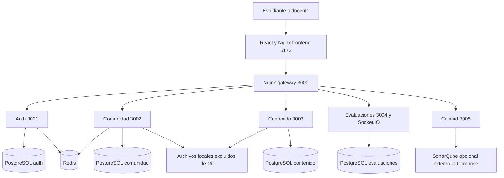

# Arquitectura e inventario de PAE Software

PAE utiliza una SPA y servicios HTTP por dominio. React consume la API mediante Nginx; las evaluaciones en vivo añaden Socket.IO. Cada dominio transaccional tiene PostgreSQL propio y Redis apoya autenticación y comunidad. El servicio de calidad consulta SonarQube sin una base propia.



## Componentes operativos

| Componente | Responsabilidad | Ruta |
| --- | --- | --- |
| Frontend | React 18, TypeScript, Vite 7, Tailwind y Radix; vistas por rol, clientes Axios y Socket.IO | [frontend](../frontend) |
| Gateway | Enrutamiento HTTP, WebSocket, cabeceras, límites y compresión | [backend/nginx](../backend/nginx) |
| Auth | Usuarios, roles, JWT, sesiones, perfil, preferencias, privacidad y tickets | [auth-service](../backend/services/auth-service) |
| Content | Repositorios, recursos, favoritos, valoración, lecciones y planificación | [content-service](../backend/services/content-service) |
| Community | Grupos, membresías, invitaciones, amigos, mensajes, recursos, descanso y desafíos semanales | [community-service](../backend/services/community-service) |
| Exam | Preguntas, intentos, revisión de abiertas, resultados, salas, seguimiento y gamificación | [exam-service](../backend/services/exam-service) |
| Quality | Consulta y normalización de métricas SonarQube, caché y API autenticada | [quality-service](../backend/services/quality-service) |
| Persistencia | PostgreSQL 15 por dominio, Redis 7 y archivos de recursos | [docker-compose.yml](../docker-compose.yml) |

`analytics-service` y `notification-service` contienen Dockerfiles preliminares, sin aplicación integrada en Compose. No se cuentan como servicios operativos. Analytics y avisos internos están principalmente en exam-service. SonarQube y un proveedor de correo no están desplegados por el Compose principal.

## API y datos

| Prefijo del gateway | Datos y operaciones |
| --- | --- |
| `/api/auth` | Registro/login, perfil, sesiones, privacidad, soporte y preferencias |
| `/api/content` | Repositorios, recursos, favoritos, categorías, lecciones, planificación y estadísticas |
| `/api/community` | Comunidades, mensajes, invitaciones, amistad, noticias, ajustes y desafíos |
| `/api/learning` | Banco, simulacros, resultados, revisión docente, desafíos, trivia, logros y ranking |
| `/api/quality` | Salud e integración de calidad de software |
| `/learning-socket` | Comunicación de evaluaciones en vivo |

Las rutas y middleware de cada servicio son la referencia técnica más cercana al comportamiento; `docs/api/Endpoints.txt` se conserva como lista histórica, no como contrato exhaustivo actualizado. Los clientes del frontend agrupan llamadas por dominio en `src/features/*/services`.

En autenticación se guardan usuarios, roles, sesiones, historial, preferencias y tickets. Contenido guarda repositorios, etiquetas, recursos, valoraciones, favoritos, lecciones, progreso y planificación. Comunidad guarda grupos, miembros, mensajes, invitaciones, amistad, recursos y contenido del hub. Evaluaciones guarda preguntas, universidades, intentos, preguntas guardadas, revisiones, partidas, ajustes, notificaciones y eventos de gamificación. Los archivos binarios se almacenan en carpetas montadas, no en Git.

La comunicación usa IDs de usuarios entre dominios y un secreto JWT compartido. Cada servicio debe verificar autorización sobre el recurso además de la firma. La revocación de tokens se implementa en auth con Redis; debe verificarse su propagación al resto de servicios antes de aceptar el cierre global como control integral.

## Inicialización y evolución del esquema

Los SQL de `database/` son esquemas y datos de referencia, no volcados productivos. Se ejecutan al crear volúmenes vacíos. Los servicios usan Sequelize y sincronización de modelos; exam-service inicializa también preguntas y reglas de referencia. No hay un sistema de migraciones versionadas completo para cada evolución del esquema. Incorporarlo y probar rollback/compatibilidad es parte de la preparación productiva.

## Organización del repositorio

```text
backend/
  nginx/                    Gateway
  services/                 Servicios por dominio
database/                   Inicialización SQL
frontend/
  src/app/                  Router y composición
  src/features/             Clientes, hooks y componentes funcionales
  src/pages/                Pantallas de estudiante y docente
docs/                       Resumen, trazabilidad y guías
  historias/                Criterios originales por módulo
scripts/                    Configuración, revisión, respaldos y calidad
tests/dynamic/              Pruebas contra una API en ejecución
.github/workflows/          Validación y despliegue manual del frontend
```

Las pruebas de contenido incluyen mocks y aplicaciones de prueba; algunas no recorren el controlador productivo completo. Las reglas de respuesta en vivo tienen pruebas unitarias y calidad prueba transformación/consulta de métricas. No se infiere cobertura integral a partir de esos resultados.

## Decisiones de esta publicación

- Copia de los fuentes actuales con historial Git nuevo; preservación del proyecto original.
- Node 24 en Docker y CI; archivos de bloqueo para instalaciones mediante `npm ci`.
- Puertos locales enlazados a loopback; ninguna base se expone por defecto a la red externa.
- Credenciales generadas por entorno y ausencia de contraseñas de respaldo en configuración.
- GitHub Pages manual. No se despliegan backend, bases ni túneles al hacer push.
- Documentos de requisitos con fuente identificada y distinción entre objetivo, implementación y evidencia de pruebas.

## Límites de arquitectura

El diseño por servicios facilita separación, pero también introduce coordinación de identidad, revocación, transacciones y errores entre dominios. Hay controladores grandes y lógica de demostración. Faltan observabilidad centralizada, migraciones, envío externo de notificaciones, endurecimiento de permisos y pruebas de fallos/reconexión. No se presenta la estructura como una certificación de SOLID, alta disponibilidad o escalabilidad horizontal.
